# Exercise 1- Network Management and Monitoring Revisited: Flow Logs and Traffic Analytics

Network management and monitoring play a crucial role in maintaining a secure and efficient network infrastructure. In addition to traditional monitoring methods, flow logs and traffic analytics provide valuable insights into network traffic patterns and behavior.

Flow logs capture detailed information about network flows, including source and destination IP addresses, ports, protocols, and packet counts. They offer visibility into network traffic at the packet level, aiding in troubleshooting, detecting anomalies, and understanding network behavior.

Combining flow logs and traffic analytics enables network administrators to gain comprehensive visibility, streamline troubleshooting, and make data-driven decisions for network optimization and security enhancement.

This exercise includes the following tasks:

  - NSG Validation **(Optional)**.
  - Configure WAF to protect your web application.
  - Add firewall diagnostics settings.
  - Network Watcher Traffic Analytics to monitor the network.
  
## **Task 1: NSG Validation (Optional)**

In this task, you'll access the virtual machine by configuring an inbound port rule in the network security group.

1. From the Azure **Home** page, search for **Application gateways (1)** in the search bar and select **Application gateways (2)**.
 
      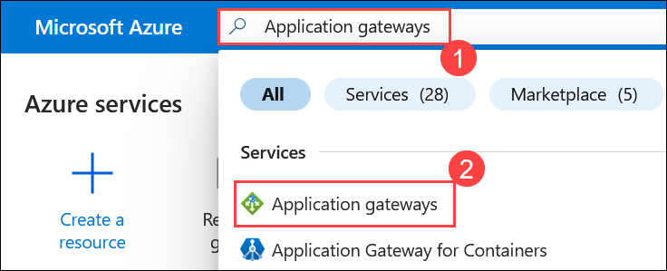
    
 1. Select your **Application Gateway**.

      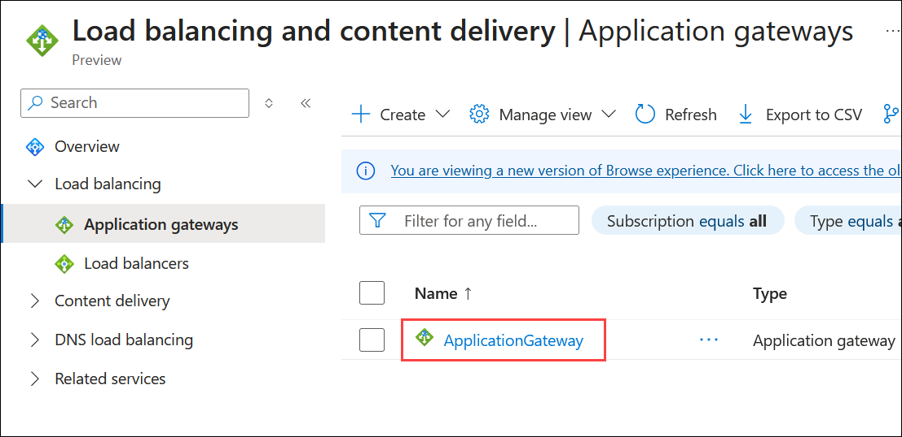
      
 1. On the Application gateway page, click on the **Backend pools (1)** under **Settings** and then select **AGBackendtarget (2)**.

     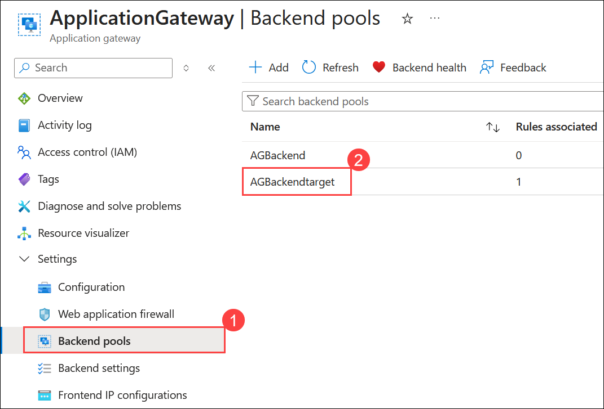
     
 1. On the **Edit backend pool** page, follow the instructions below:

    - **Target type:** Select **Virtual machine (1)** from the drop-down.

    - **Target:** Select **FirewallVM-nic (2)** from drop-down.

    - Click on **Save (3)**.

      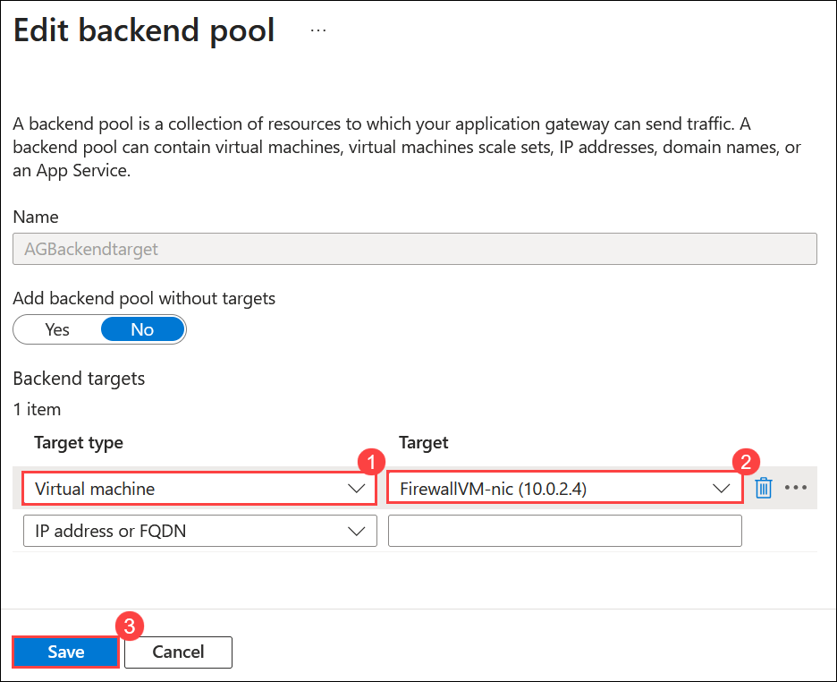
    
1. Once the Backend pools are saved, you will see the notification that says **Deployment succeeded**.

   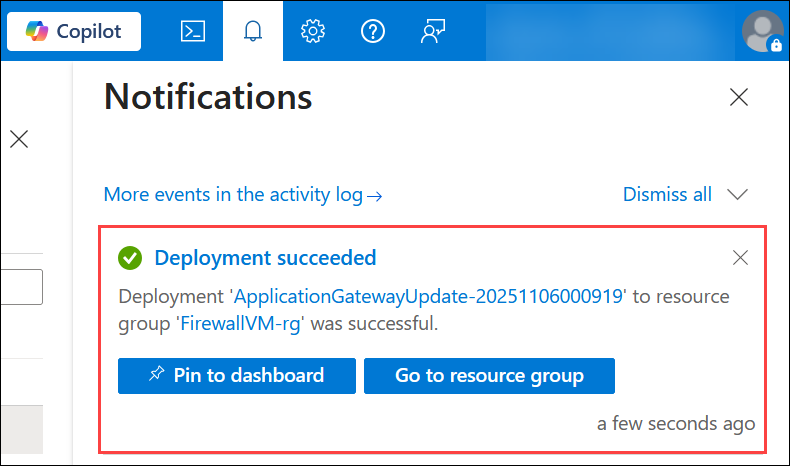

1. Navigate back to the home page and search for **Application Firewall Policies (1)** from the search bar and select **Web Application Firewall policies (WAF) (2)**.

   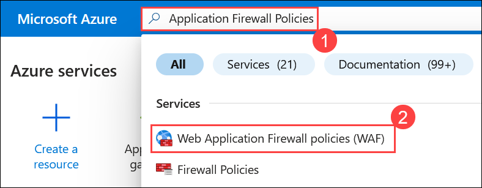
 
1. On the **Network security | Web Application Firewall** page, click on **Firewall policy**.

   .png)

1. Navigate to **Settings > Associations (1)**, click **+ Add Association (2)**, and select **Application Gateway (3)**.

    .png)
    
1. Under the **Associate an application gateway** page, follow the instructions below:

    - **Application Gateway (WAF v2 SKU):** Select **Application Gateway (1)** from the drop down. 
    
    - **Check** the box next to **Apply the Web Application Firewall policy configuration even if it's different from the current configuration (2)**.
    
    - Click on **Add (3)**.

      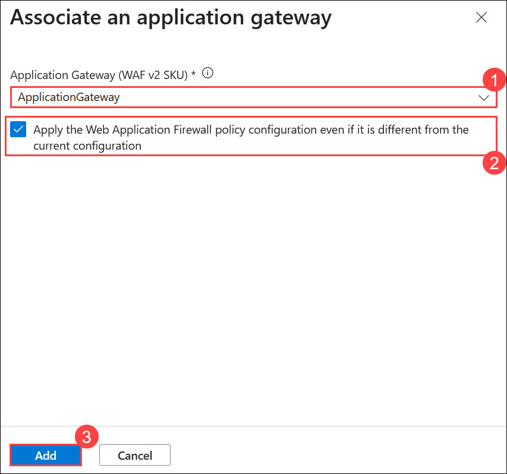

1. Once the Application Gateway are saved, you will see the notification that says **Updated the Application Gateway**.

   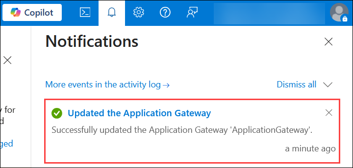

## **Task 3: Add firewall diagnostics settings** 

In this task, you will enable diagnostic settings in Azure Firewall to collect firewall logs.

1. Navigate to the home page in the Azure portal, search for **Subscriptions (1)** and select **Subscriptions  (2)** from suggestions.

   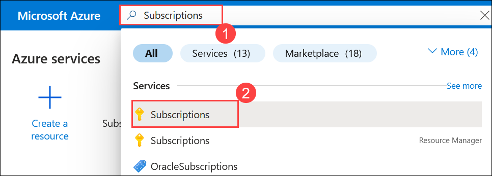

1. Select the **default subscription** available in the list.

   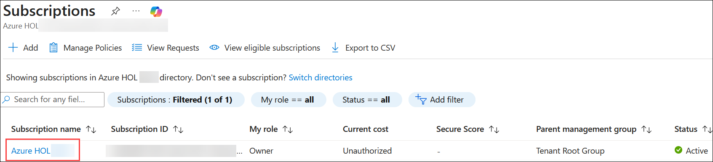

1. From the left-side blade, select **Preview features (1)** under **Settings** and click on **Provider:All (2)** to select **Microsoft.Network (3)** in the Provider list and click on **Apply (4)**.

   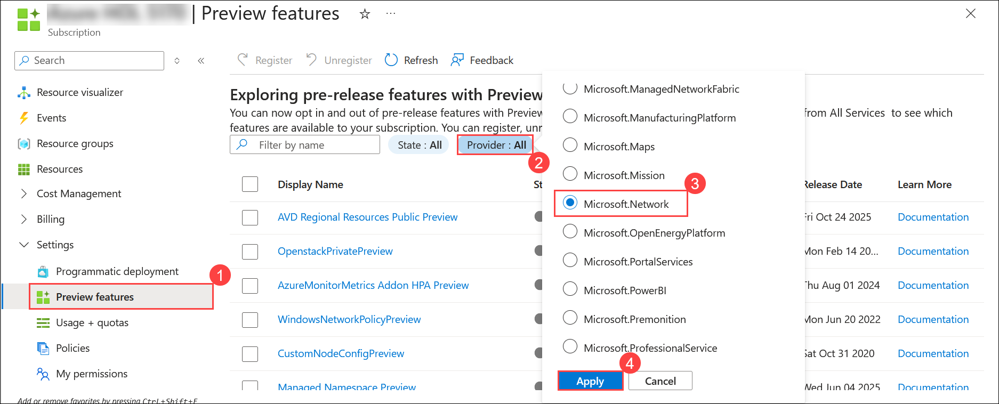

1. Now you should be able to see the **Enable Azure Firewall Structured Logs** is already registered by default.

   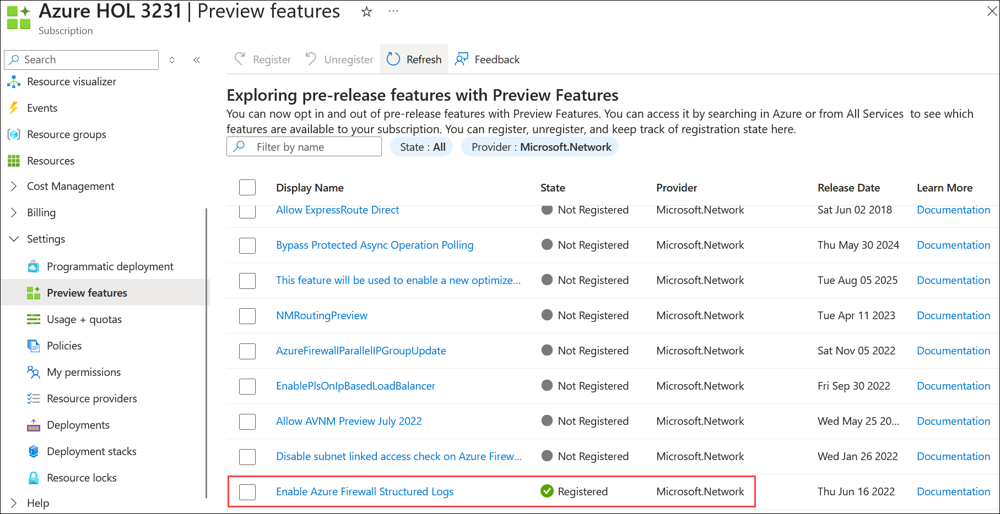

   > **Note:** If the preview feature is not registered, Select **Enable Azure Firewall Structured Logs (1)** then click on **Register (2)**. On the **Do you want to register the selected features?** pop-up, choose **OK**.

      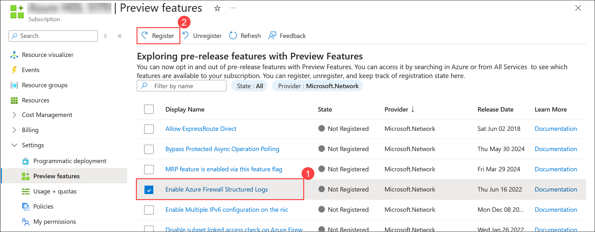

1. In the Azure portal, navigate to your **FirewallVM-rg** resource group and select the **AzureFirewall** resource.

   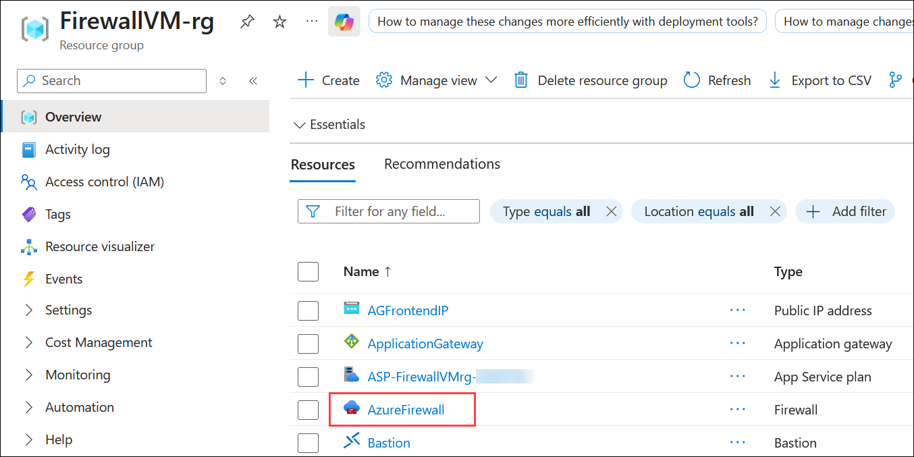

1. On the firewall page, under **Monitoring** section select **Diagnostic settings (1)** and select **+ Add diagnostic setting (2)** on the **Diagnostic settings** page.

   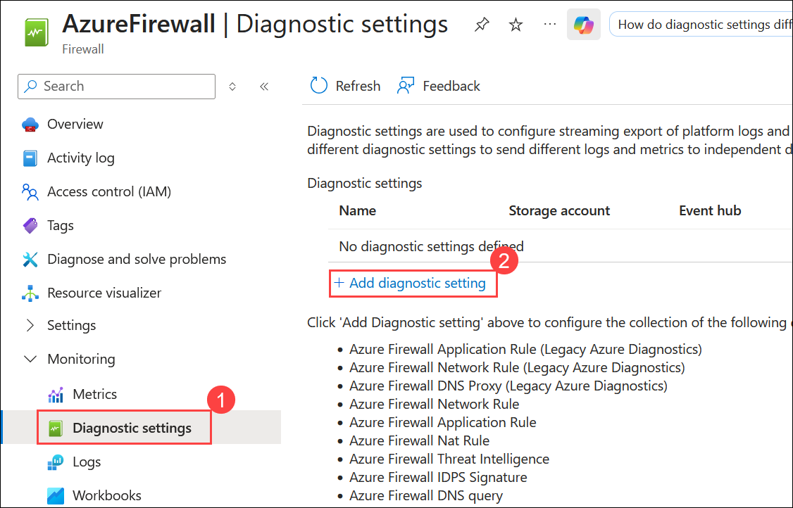

1. Enter the **Diagnostic setting name** as **fw-diagnostics**.

   

1. Under **Logs**, select the below mentioned categories.
   
   - Azure Firewall Application Rule
   - Azure Firewall Network Rule
   - Azure Firewall Nat Rule
   - Azure Firewall Threat Intelligence
   - Azure Firewall IDPS Signature
   - Azure Firewall DNS query
   - Azure Firewall FQDN Resolution Failure
   - Azure Firewall Fat Flow Log
   - Azure Firewall Flow Trace Log

     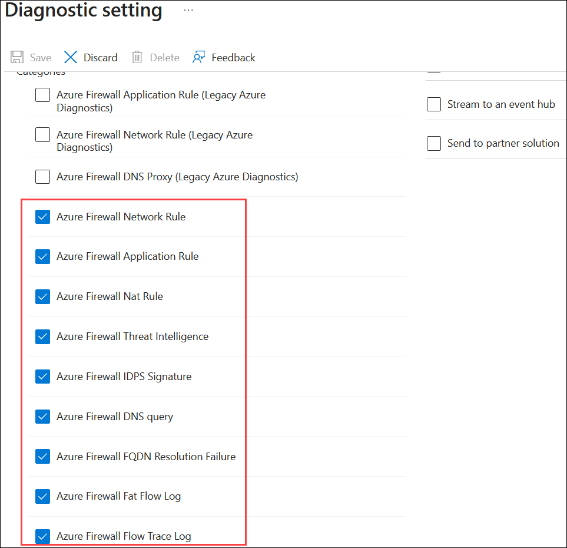

1. Under **Destination details**, select **Send to Log Analytics workspace (1)**, choose **Resource specific (2)** for the Destination table option, and then click **Save (3)**.

   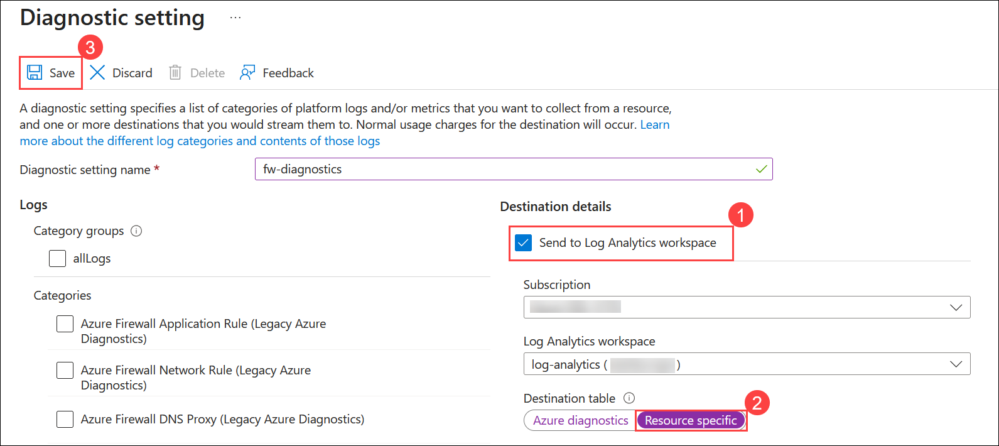

   <validation step="c6207003-7e0d-467c-a0cb-9bb7fbbc5246" />  

   > **Congratulations** on completing the lab! Now, it's time to validate it. Here are the steps:
    > - Navigate to the Lab Validation Page, from the upper right corner in the lab guide section.
    > - Hit the Validate button for the corresponding task. If you receive a success message, you can proceed to the next task. 
    > - If not, carefully read the error message and retry the step, following the instructions in the lab guide.
    > - If you need any assistance, please contact us at cloudlabs-support@spektrasystems.com. We are available 24/7 to help you out.

## **Task 4: Network Watcher Traffic Analytics to monitor the network**

In this task, you will enable the Traffic Analytics in the NSG flow logs and review the logs.
 
1.  In the Azure portal, from the search bar, search for **Application gateways (1)** and then select **Application gateways (2)**.
 
     
 
1. Select your **Application Gateway**.
 
     
 
1. Select the **Frontend public IP address** of the application gateway.
 
    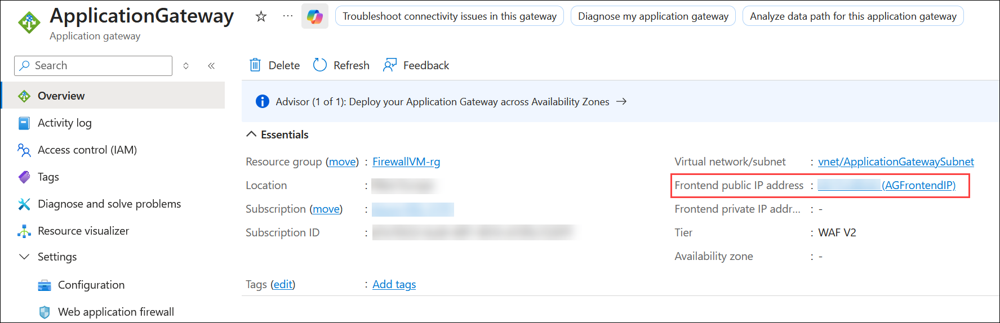

1. Copy the **IP address** and save it to Notepad for later use.

    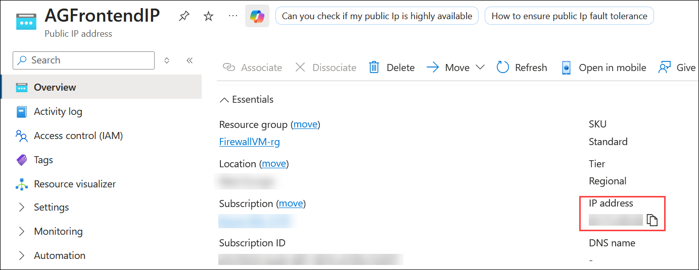
    
1. On the Azure Portal **Home** page, search for **Firewalls (1)** and then select **Firewalls (2)**.

   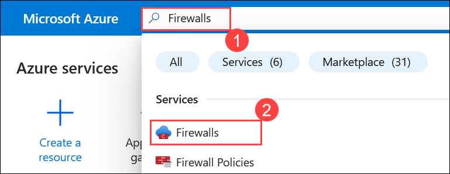
    
1. Click on the **AzureFirewall**.

    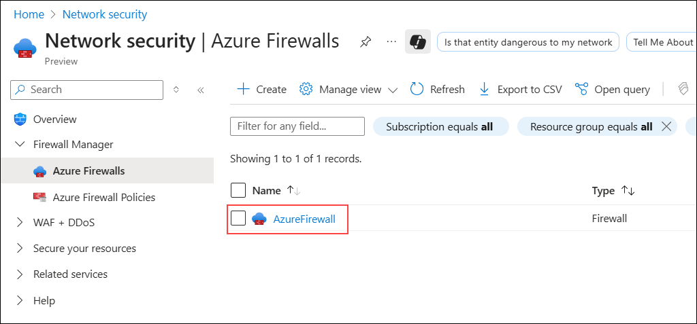
   
1. Select **Firewall Public IP** from the **Overview** tab.

    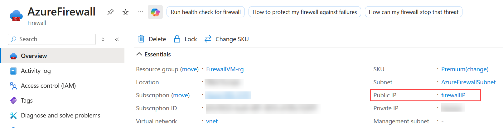
    
1. Copy the **IP address** and save it to Notepad for later use.

    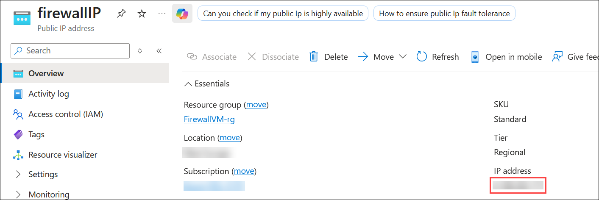  
     
1. Navigate back to Azure Firewall, select **Firewall Manager (1)** from the **Settings** tab, and click **Visit Azure Firewall Manager to configure and manage this firewall (2)**.

   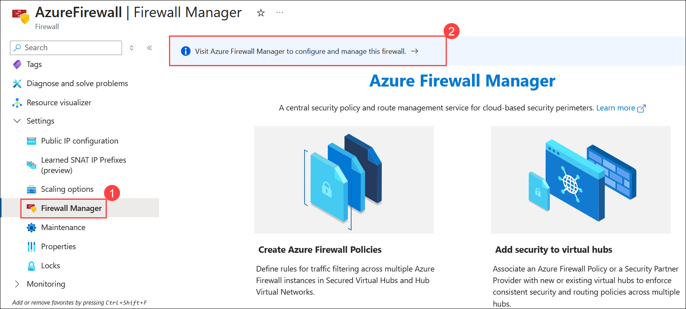
    
1. Select **Azure Firewall Policies (1)** under **Firewall Manager**, then click on the firewall policy named **firewallpolicy (2)**.

   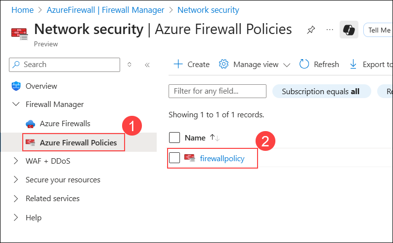
   
1. Select **DNAT rules (1)** from the **Rules** tab on the **Firewall Policy** page, then click **+ Add a rule collection (2)**.

   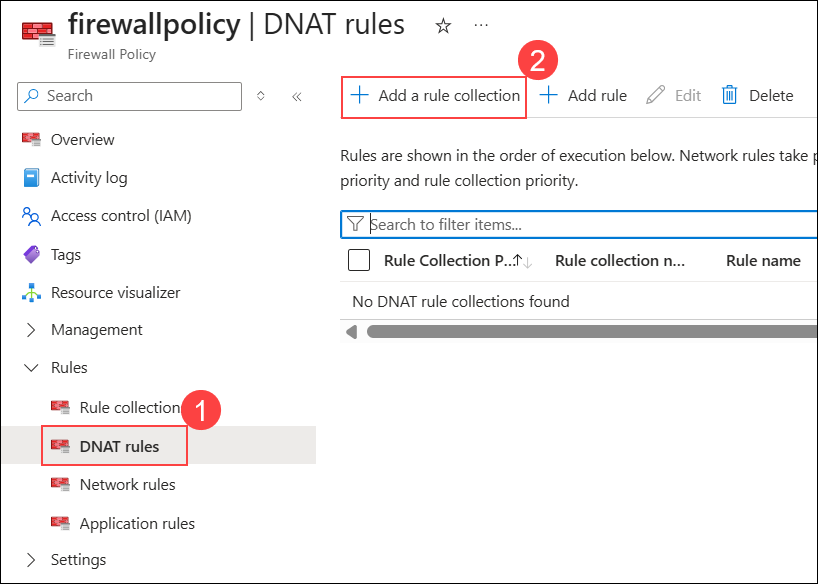
    
1. Under the **Add a rule collection** page, enter the details below:

    - Name: **afw-contoso-prod-firewall-rulecolection (1)**
    - Rule Collection type: **DNAT (2)**
    - Priority: **100 (3)**
    - Rule collection group: **DefaultDnatRuleCollectionGroup (4)**
    - Under **Rules (5)** mention the below details:
      - Name: **afw-dnat-http**
      - Source type: Select **IP Address** from the drop-down list
      - Source: Enter *
      - Protocol: Select **TCP** from the drop-down list
      - Destination Ports: **80**
      - Destination (Firewall PIP address): Enter the IP address of the **Firewall** which you copied in step 8.
      - Translated type: Select **IP Address** from the drop-down list
      - Translated address or FQDN: Enter the Public IP address of the **Application gateway** which you copied in step 4.
      - Translated port: **80**
     
     - Click on **Add (6)**.

       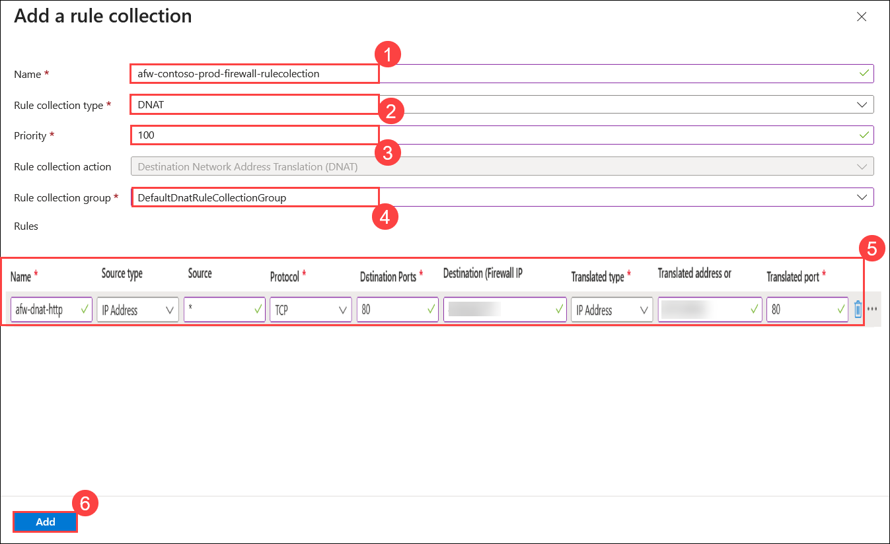

     > **Note:** This may take a few minutes to update the rule collection group. Please wait for the updates to complete before proceeding to the next steps.
      
1. Navigate to the Firewall's public IP address and generate some traffic by refreshing the browser.

    

1. In the Azure portal, search for **Network Watcher (1)** and select **Network Watcher (2)**.

   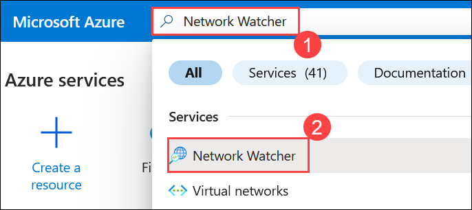

1. From the left navigation menu under the **Monitoring** section and click on **Traffic Analytics (1)**. On the **Traffic Analytics** page, set the **Flow log subscription** to **Default subscription (2)** ,**Flow log type** to **VNet (3)** and then **Time interval** to **Last 30 minutes (4)** 

   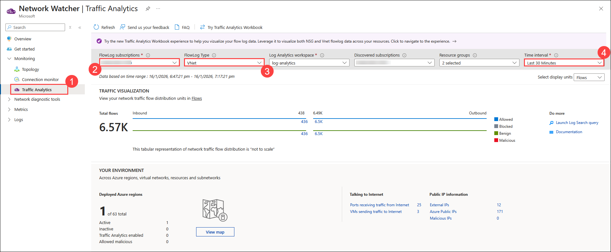
   
   > **Note:** If you observe the Time interval is greyed out, click on Meanwhile, click here to see just resource data and perform the above step.
   
   > It may take up to 30 to 60 minutes to click on **Meanwhile, click here to see just resource data and perform the above step option to come up**.

      
      
1. Now, you can observe the total number of network traffic flows from **Traffic Visualization** present in the **Traffic Analytics** page.

    .png)

    > **Note:** The dashboard may take up to 60-90 minutes to appear when deployed for the first time. This is because Traffic Analytics must first aggregate enough data for it to derive meaningful insights. If it takes more time, you can perform the next task and come back later and check on this.
           
1. Under **Traffic Analytics**, Scroll down to **Your Environment** to view the total number of **Deployed Azure regions (1)**, **Talking to Internet (2)**, **Virtual networks (3)**, and **Virtual subnetworks (4)**.

    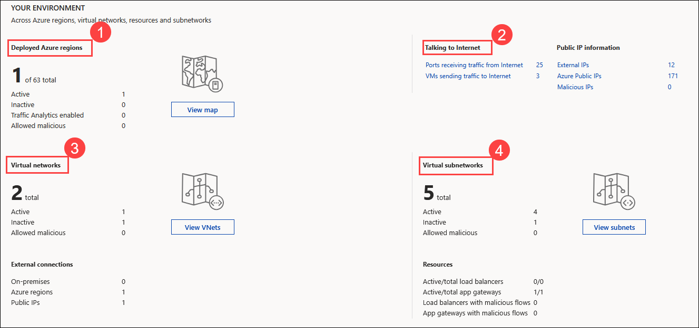
      
1. To visualize the traffic distribution by geography, click on **View map**. The geo-map shows the traffic distribution to a data center from countries/regions and continents communicating with it.

    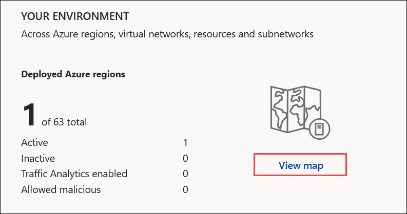
     
1. In the **Traffic Analytics Geo Map View** page, click on the **Green** icon which indicates the Azure region, and observe the resources deployed under the region, to explore more select **More details**.

    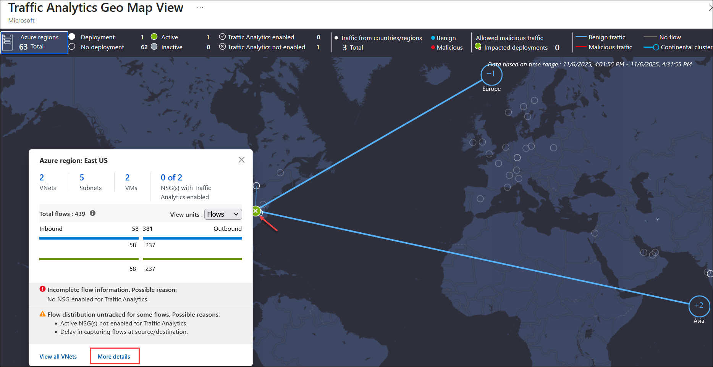
      
1. Under the **More Insights** blade, scroll down and explore traffic distribution for deployments of the East US region.

    .png)
     
1. To close the **Traffic Analytics Geo Map View**, click on the cross at the top right corner.

     
      
1. Close the **Ports receiving traffic from the Internet** page by clicking the **Cross (X) icon** in the top right corner.
      
1. Under the Traffic Analytics page, scroll down to **Traffic Distribution** to view the analytics of traffic flows across the host, subnet, VNet, and VMSS.

    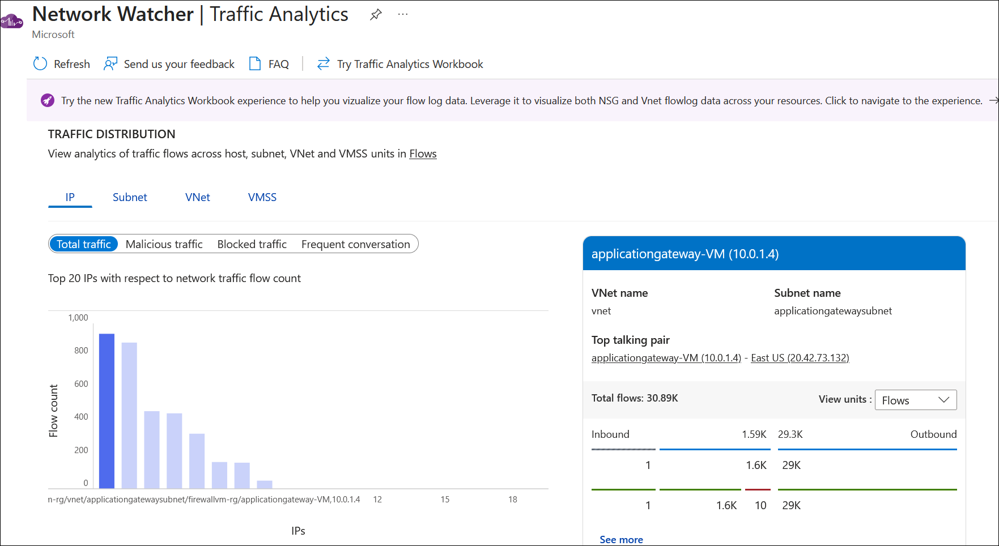
     
1. To view the analytics of traffic flows across the host, select **IP (1)**, then select **See all (2)** from **Traffic Distribution**.

    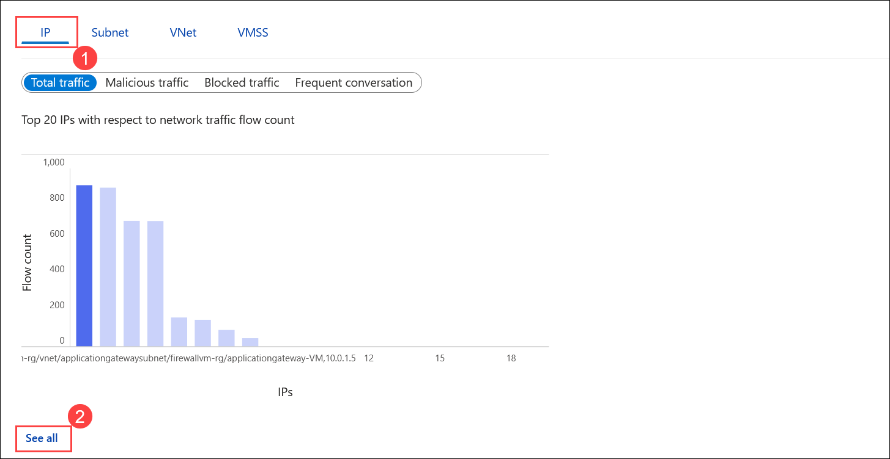
    
1. You can observe the graph of the **Time trending chart for the top 5 talking IPs** from the **Traffic distribution across the top IPs** page.

    .png)
    
1. Under **Details of top 5 talking IPs**, select VM IP to explore more about traffic distribution.

    .png)
     
1. Close the **Traffic distribution across top IPs** by clicking the **cross (X) icon** at the top-left corner of the page.
    
1. In the same way, you can explore more about **Malicious traffic**, and **Blocked traffic** 

1. Now scroll down to **Application ports (1)**, to view analytics for application ports utilized across your environment and select **See all (2)**.

    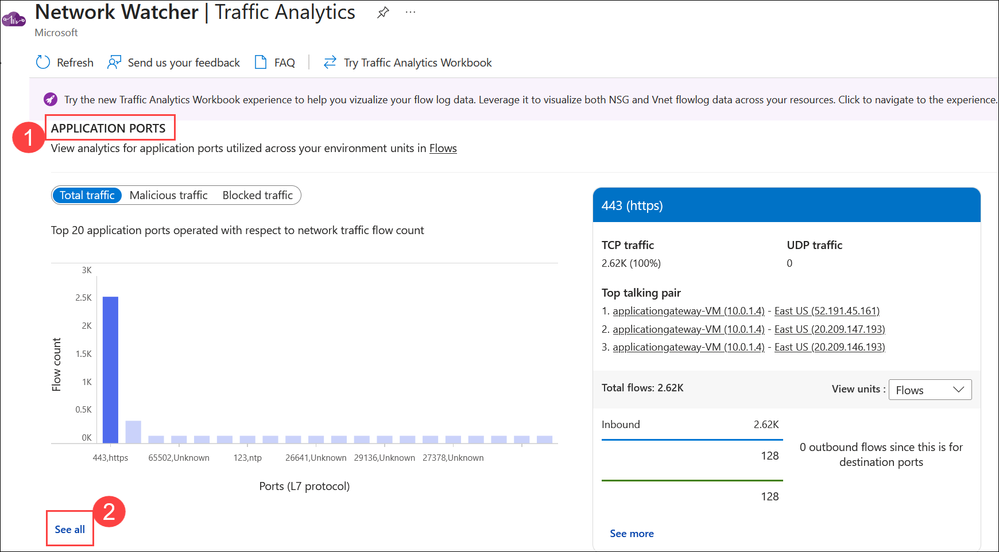
     
1. From the **Most frequent L7 protocols** page, you can explore more about the ports and their ranging.

    .png)

1. Under **Details of Most frequent L7 protocols**, select VM IP to explore more about traffic distribution.

    .png)

   <validation step="a223c077-e008-44a7-a7e7-b07b393d0d58" /> 

   > **Congratulations** on completing the lab! Now, it's time to validate it. Here are the steps:
    > - Navigate to the Lab Validation Page, from the upper right corner in the lab guide section.
    > - Hit the Validate button for the corresponding task. If you receive a success message, you can proceed to the next task. 
    > - If not, carefully read the error message and retry the step, following the instructions in the lab guide.
    > - If you need any assistance, please contact us at cloudlabs-support@spektrasystems.com. We are available 24/7 to help you out.

## Summary

In this lab, you explored critical aspects of network management and monitoring in Azure, focusing on enhancing network security and visibility. You validated Network Security Group (NSG) rules, configured the Web Application Firewall (WAF) to protect web applications, and enabled diagnostic settings for Azure Firewall to collect detailed logs. Additionally, you implemented Traffic Analytics to monitor and analyze network traffic patterns. These tasks provided you with hands-on experience in securing and optimizing network infrastructure, enabling data-driven decisions for improved network performance and security.

## Review
 
In this exercise you have covered the following:
  
   - Performed NSG validation.
   - Configure WAF to protect your web application.
  - Add firewall diagnostics settings.
   - Monitored the network watcher traffic.

## You have successfully completed the lab.
