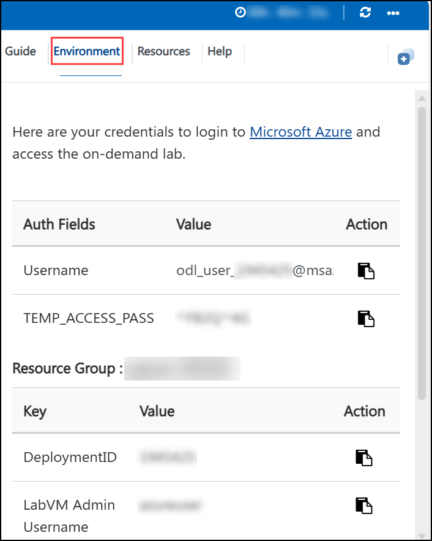
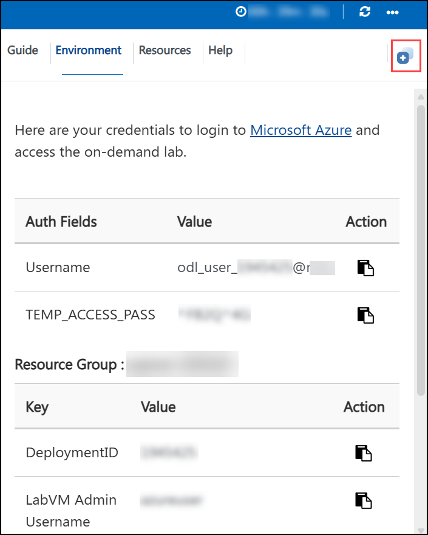
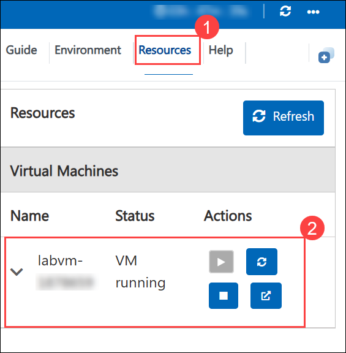
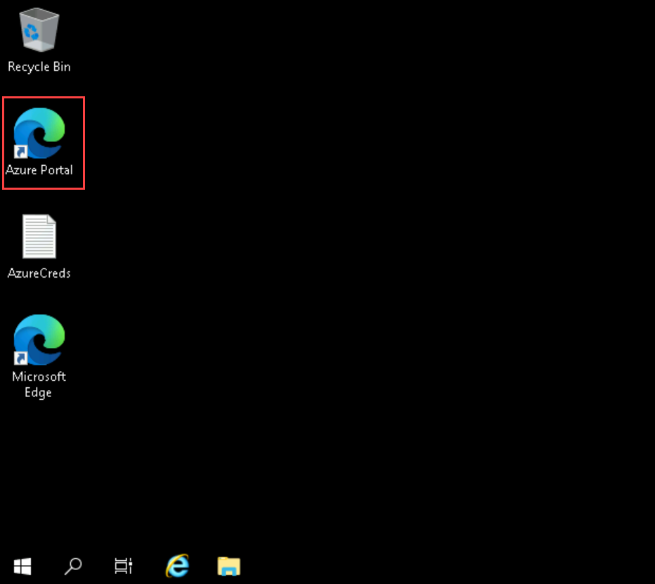
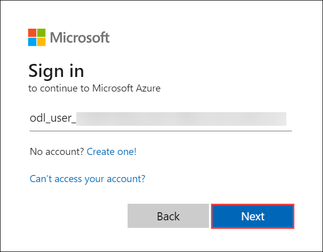

# Getting Started with Your Microsoft Azure Infrastructure and Application Security Workshop

### Overall Estimated Duration : 1 hour 30 Minutes

## Overview 

Azure DDoS Protection is a comprehensive solution designed to defend cloud-based infrastructures from distributed denial-of-service (DDoS) attacks. By leveraging Azure's global network scale and advanced mitigation techniques, this service ensures the availability and security of your applications against volumetric, protocol, and application-layer attacks. Azure DDoS Protection works seamlessly with your virtual networks and public IP addresses to provide robust security without requiring application changes.  

In this hands-on lab, you will configure Azure DDoS Protection to safeguard your cloud infrastructure. You will set up a DDoS protection plan, secure public IP addresses, and monitor key metrics to identify and mitigate potential threats. Through these tasks, you'll gain practical experience in protecting virtual networks and public-facing resources, ensuring resilience and high availability for your applications.

## Objective  
 
**Protecting Infrastructure with Azure DDoS Protection Plans:** Learn to configure and manage Azure DDoS Protection to safeguard your cloud infrastructure against distributed denial-of-service (DDoS) attacks. In this lab, you will set up a DDoS protection plan to enhance the security of virtual networks and configure IP protection to defend public-facing IP addresses from potential threats. Gain hands-on experience in monitoring and analyzing key metrics such as inbound SYN, TCP, and UDP packets to proactively detect and mitigate DDoS attacks. By the end of this lab, you will have the skills to effectively secure your Azure resources.

## Prerequisites

Participants should have:  
  
- **Understanding of Virtual Networks (VNets)**: Familiarity with the concept of virtual networks, their role in cloud infrastructure, and how they interact with other Azure resources.  
- **Awareness of DDoS Concepts**: Basic understanding of Distributed Denial of Service (DDoS) attacks, including their types (volumetric, protocol, and resource layer attacks) and impact on availability and security.  
- **Basic Monitoring Skills**: Familiarity with Azure's monitoring tools, including visualizing metrics and interpreting data for proactive threat detection and mitigation.  

## Architecture

The architecture involves using Azure DDoS Protection Plans to safeguard against various types of DDoS attacks. DDoS Network Protection is configured to defend the Virtual Network, providing automatic mitigation for volumetric, protocol, and resource layer attacks. The Public IP Address is secured through DDoS IP Protection, which ensures that external-facing resources are protected against DDoS threats. Finally, Azure Metrics is used to visualize traffic data, allowing administrators to monitor key indicators like inbound SYN, TCP, and UDP packets to track DDoS mitigation performance and ensure that the infrastructure remains secure and resilient against potential attacks.

## Architecture Diagram 

 

## Explanation of Components

The architecture for this lab involves the following key components:

- **Azure DDoS Protection Plans:** Central to mitigating distributed denial-of-service (DDoS) attacks, this component provides automatic protection for resources in the virtual network. It defends against volumetric, protocol, and resource-layer attacks, ensuring high availability and security.

- **Public IP Address:** Represents the external-facing endpoint of Azure resources. DDoS IP Protection is configured on specific public IP addresses, enhancing security for applications and services exposed to the internet.

- **Azure Metrics:** Enables monitoring and visualization of network activity and DDoS mitigation metrics. It provides insights into traffic patterns, such as inbound SYN, TCP, and UDP packets, which are crucial for detecting and managing DDoS attempts effectively.

- **Firewall Manager:** Acts as a centralized management tool for monitoring the deployment and protection status of virtual networks. It confirms that DDoS protection is active and operational across configured resources.

## Getting Started with the Lab Environment

## Accessing Your Lab Environment

Once you're ready to begin, your virtual machine and lab guide will be available directly within your web browser.

## Virtual Machine & Lab Guide

The virtual machine provides access to the Azure Portal and Microsoft security portals.  
The lab guide remains visible throughout the lab exercises.

## Exploring Your Lab Resources

Navigate to the **Environment** tab to review lab resources and credentials.

## Utilizing the Split Window Feature

Use the **Split Window** button in the top-right corner to open the lab guide in a separate window for easier navigation.

## Managing Your Virtual Machine

Start, stop, or restart your virtual machine as needed from the **Resources** tab.

## Lab Guide Zoom In / Zoom Out

Adjust the zoom level using the **A↕ : 100%** icon located next to the timer.

## Let's Get Started with Azure Portal

1. On the virtual machine, click the **Azure Portal** icon:

    

1. On the **Sign in to Microsoft Azure** page, enter:

   - **Email/Username:** <inject key="AzureAdUserEmail" enableCopy="true"/>

       

1. Enter the password:

   - **Password:** <inject key="AzureAdUserPassword" enableCopy="true"/>

      

1. Select **No** when prompted to stay signed in.

   

## Support Contact

CloudLabs support is available 24/7 to assist learners and instructors.

- **Email:** cloudlabs-support@spektrasystems.com  
- **Live Chat:** https://cloudlabs.ai/labs-support  

Now, click on **Next** from the lower right corner to move on to the next page. 

### Happy Learning!!
